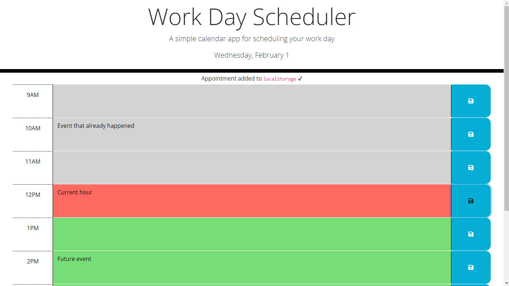

# Work Day Scheduler
A simple calendar application that allows you to save events for each hour of the day.

## Features
- Displays the current day of the week.
- Tracks your schedule using time blocks from 9AM to 5PM.
- Based on the current time, displays past hours in gray, current hour in red, and future hours in green.
- Stores text input for each hour when the hour's save button is clicked.

## Screenshot

## Links
- [Deployed Site](https://ckboytgt.github.io/work-day-scheduler/)
- [GitHub Repo](https://github.com/CKBoytGT/work-day-scheduler)